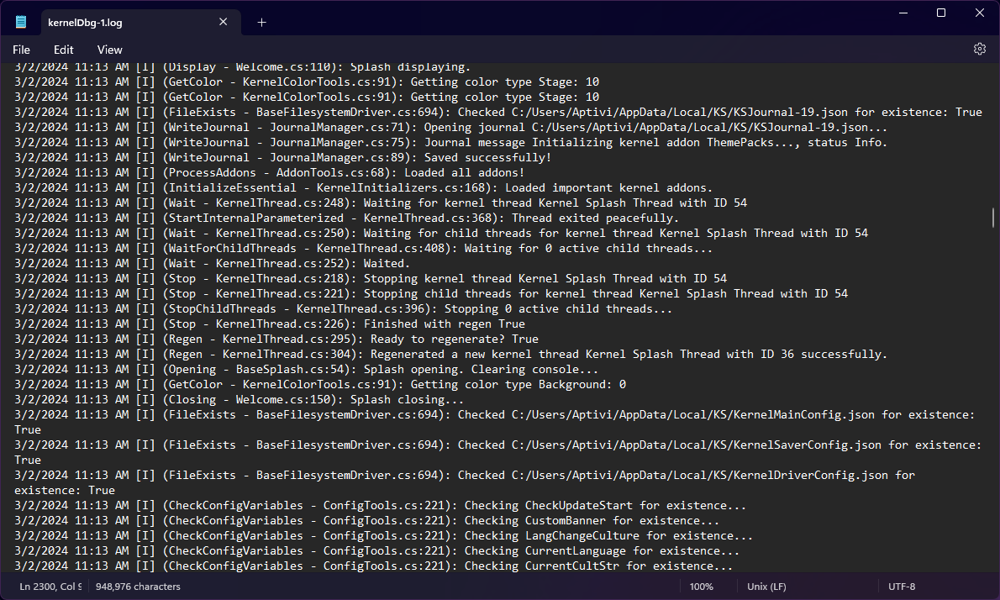

# Local Debugging

Locally debugging the kernel allows you to diagnose the kernel directly on the host computer. Debugging information from different kernel components are saved to a kernel debugging file, `kernelDbg-#.log`, where it is numbered depending on how many times the kernel is run.

## Structure

The structure of the local debugging log is like the below picture:

<figure><figcaption></figcaption></figure>

The local debug logs contain two versions of formatting:

### Classic

```
date time [level] (method - source:linenum): message
```

Each of these fields have their own values, as follows:

* `date`: The date of the event
* `time`: The time of the event
* `level`: One character error level, which is one of:
  * `T`: Trace verbose message
  * `D`: Debug verbose message
  * `I`: Informational message
  * `W`: Warning message
  * `E`: Error message
  * `F`: Fatal error message
* `method`: The method name in which the message was posted
* `source`: The source code file where the method is found
* `linenum`: The line number from the source file
* `message`: The message

### Modern

```
date time (fully-qualified-method)
==================================

[level] : message
```

Each of these fields have their own values, as follows:

* `date`: The date of the event
* `time`: The time of the event
* `level`: One character error level, which is one of:
  * `T`: Trace verbose message
  * `D`: Debug verbose message
  * `I`: Informational message
  * `W`: Warning message
  * `E`: Error message
  * `F`: Fatal error message
* `fully-qualified-method`: The full method name in which the message was posted
* `message`: The message

## Debug your Mods

To debug your mods, they must call the debug functions in order for the kernel to acknowledge your message. There are useful functions listed below that may help you debug your routines in your mods.


You can also use the Output window if you've built Nitrocid KS with `VSDEBUG` compiler constant, but it has severe performance repercussions.


### Normal Debugging

Calling the debug function below will post your debug message to the kernel debugger normally. There's a function for you to call below:

```csharp
public static void WriteDebug(DebugLevel Level, string text, params object[] vars)
```

Found in the `DebugWriter` module under the `Nitrocid.Kernel.Debugging` namespace.

### Conditional Debugging

Calling the debug function below will post your debug message to the kernel debugger if the condition that you've set within the function is satisfied. There's a function for you to call below:

```csharp
public static void WriteDebugConditional(bool Condition, DebugLevel Level, string text, params object[] vars)
```

Found in the `DebugWriter` module under the `Nitrocid.Kernel.Debugging` namespace.

### Privacy-aware Debugging

Calling the debug function below will post your debug message to the kernel debugger normally. However, it also filters every variable you've selected to be censored in the debug log. For example, if you provide two variables (A, B) and B contains sensitive info, you may want to create an array of indexes which holds B's index (in this case, 1) when calling the below function.

```csharp
public static void WriteDebugPrivacy(DebugLevel Level, string text, int[] SecureVarIndexes, params object[] vars)
```

Found in the `DebugWriter` module under the `Nitrocid.Kernel.Debugging` namespace.

### Stack Trace Debugging

Calling the debug function below will post the stack trace of an exception, including its inner exceptions, to the kernel debugger. There's a function for you to call below:

```csharp
public static void WriteDebugStackTrace(Exception Ex)
```

Found in the `DebugWriter` module under the `Nitrocid.Kernel.Debugging` namespace.

### Stack Trace Conditional Debugging

Calling the debug function below will post the stack trace of an exception, including its inner exceptions, to the kernel debugger if the condition that you've set within the function is satisfied. There's a function for you to call below:

```csharp
public static void WriteDebugStackTraceConditional(bool Condition, Exception Ex)
```

Found in the `DebugWriter` module under the `Nitrocid.Kernel.Debugging` namespace.

## Debug quotas

If you want to rotate logs each `n`th message, such as the 10000th message, you can enable this feature by going to the kernel settings and enabling it there. You can also set the number of messages before the log rotation occurs.

If this session's debug quota is exceeded, the new debug file is created with the increasing number. For example, if `kernelDbg-0.log` exceeds 10000 messages, the debugger creates the `kernelDbg-1.log` and writes further messages there, and so on.


You'll need to restart the kernel to make use of this feature.

