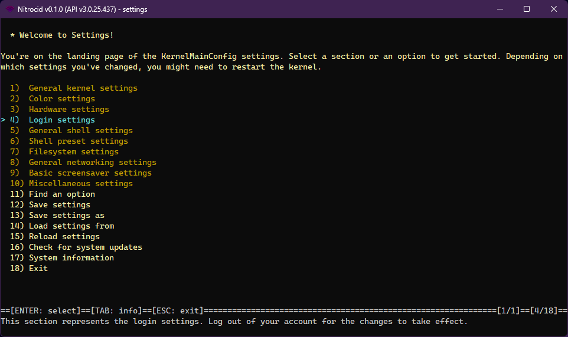

# Kernel Settings

The kernel is extensively configurable. It allows you to customize your kernel to fit your needs across all areas, ranging from general kernel settings to networking to screensavers. It's an exciting feature!

## How it works?

The kernel configuration files are stored in the below software paths (`Paths.AppDataPath` under the `KS.Files` namespace):

* Windows: `%localappdata%\KS\`
* Linux: `~/.config/ks/`

When the kernel starts up, different configuration files are read for different purposes. The below settings paths describe the purpose and the type of each (with all the addons).

```
d-----          3/2/2024  11:29 AM                KSEvents
d-----          3/2/2024  11:29 AM                KSMods
d-----          3/2/2024  11:29 AM                KSReminders
-a----          3/2/2024  11:29 AM              4 Aliases.json
-a----          3/2/2024  11:29 AM            270 AmusementsConfig.json
-a----          3/2/2024  11:29 AM            718 AmusementsSaversConfig.json
-a----          3/2/2024  11:29 AM             38 AmusementsSplashesConfig.json
-a----          3/2/2024  11:29 AM             40 ArchiveConfig.json
-a----          3/2/2024  11:29 AM             46 BassBoomConfig.json
-a----          3/2/2024  11:29 AM             28 BassBoomSaversConfig.json
-a----          3/2/2024  11:29 AM             49 CalendarConfig.json
-a----          3/2/2024  11:29 AM              2 Consents.json
-a----          3/2/2024  11:29 AM             22 ExtensionHandlers.json
-a----          3/2/2024  11:29 AM          30915 ExtraSaversConfig.json
-a----          3/2/2024  11:29 AM            234 ExtraSplashesConfig.json
-a----          3/2/2024  11:29 AM             26 ForecastConfig.json
-a----          3/2/2024  11:29 AM            554 FtpConfig.json
-a----          3/2/2024  11:29 AM             36 GitConfig.json
-a----          3/2/2024  11:29 AM             42 HttpConfig.json
-a----          3/2/2024  11:29 AM            139 JsonConfig.json
-a----          3/2/2024  11:29 AM            399 KernelDriverConfig.json
-a----          3/2/2024  11:29 AM           7174 KernelMainConfig.json
-a----          3/2/2024  11:29 AM             92 KernelSaverConfig.json
-a----          3/2/2024  11:29 AM          47407 KSJournal-0.json
-a----          3/2/2024  11:29 AM            512 MailConfig.json
-a----          3/2/2024  11:29 AM             23 MAL.txt
-a----          3/2/2024  11:29 AM             27 MOTD.txt
-a----          3/2/2024  11:29 AM            218 NameGenSaversConfig.json
-a----          3/2/2024  11:29 AM              2 notes.json
-a----          3/2/2024  11:29 AM            157 RssConfig.json
-a----          3/2/2024  11:29 AM            143 SftpConfig.json
-a----          3/2/2024  11:29 AM            138 ShellHistories.json
-a----          3/2/2024  11:29 AM             41 SqlConfig.json
-a----          3/2/2024  11:29 AM             64 TimersConfig.json
-a----          3/2/2024  11:29 AM             23 TipsConfig.json
-a----          3/2/2024  11:29 AM              4 ToDoList.json
-a----          3/2/2024  11:29 AM              2 UserGroups.json
-a----          3/2/2024  11:29 AM            533 Users.json
```

## Settings

<figure><figcaption></figcaption></figure>

The kernel provides an easy-to-use tool to seamlessly configure the kernel settings. It can be easily invoked using the `settings` command. Running this command alone provides you with the normal kernel settings. The following switches will change the mode:

* `-saver`: Lets you configure the screensavers
* `-splash`: Lets you configure the splashes
* `-addonsaver`: Lets you configure the screensavers from the Extra Screensavers addon
* `-driver`: Lets you configure the kernel drivers
* `-widgets`: Lets you configure the kernel widgets for the lockscreen
* `-type=configType`: Lets you configure a custom section of the kernel settings, including your mod-defined ones.


Currently, the settings application uses Terminaux's interactive TUI feature. If you still prefer the selection style to the TUI, you can pass the `-sel` switch.


Selecting a section leads to the settings application listing all the available configuration options, which you can then set their individual options. It even allows you to save the settings if you like the current configuration, load the user settings, and find a settings entry for easier access.


Starting from 0.1.0.5, you can easily migrate most of your kernel configuration, including your speed dial settings, from the old format that 0.0.16.0 introduced back on 2021. Just open the settings app and select "Migrate old configuration."



We'll never support configuration migration for older formats, such as the `.ini` format that 0.0.4 introduced, due to deprecation of API versions 1.0, 1.1, and 1.2.


### System updates and information

From the main page, you can easily check for kernel updates and check the system information right from it.

### Inner workings

You can find more information about the mechanics of the settings application by clicking on the below link.


[mechanics-of-settings-app.md](mechanics-of-settings-app.md)


## Settings on your Shell

Additionally, you can change the kernel settings and list them using the following available commands:

* `lsconfigs`: This command allows you to list all configurations and their entries.
* `lsconfigvalues`: This command allows you to list all configuration keys and their values
* `getconfigvalue`: This command allows you to get a config value by the variable name
* `setconfigvalue`: This command allows you to set a config value by the variable name to the specified value

This feature is useful for your UESH scripts and for your quick shortcut to change your settings.

## Settings format

The settings format is out of scope for this page, so click the below link to learn more.


[settings-format.md](settings-format.md)


## Custom settings

The custom settings and its relationship with your mods is out of scope for this page, so click the below link to learn more.


[custom-settings.md](custom-settings.md)

