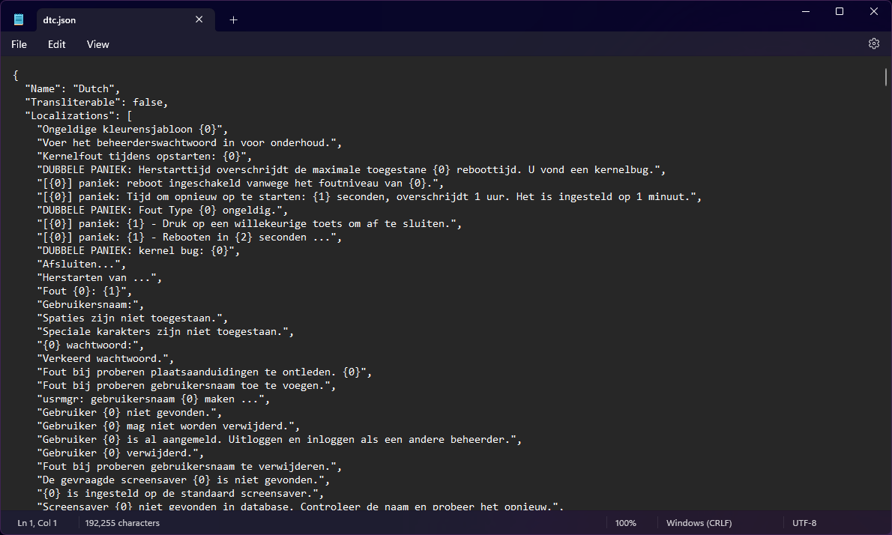

# Multilingual Kernel

The languages were introduced to the kernel to allow users who don't natively speak English or prefer their native language to use the kernel. This page explains the inner workings of the multilingual kernel.

## JSON file format

<figure><figcaption></figcaption></figure>

The kernel languages use the JSON localization files that store the following information:

* `Name`: The name of the language
  * The type of this variable is a **string**
* `Transliterable`: Whether the language contains the `-T` variant or not (transliterated vs. translated)
  * The type of this variable is a **boolean**
* `Localizations`: Contains translated strings
  * The type of this variable is an **array** of **strings**

The source of the generated JSON files come from `Nitrocid.LocaleGen`, a tool shipped with the kernel.

## Locale Generator

This program generates the above JSON file for the built-in kernel languages and the custom languages. It allows you to generate the JSON file usable for the kernel.

### Metadata

Each copy of Nitrocid KS provides you two placeholder folders, `CustomLanguages` and `Translations`. Each of these folders must contain the metadata JSON file, `Metadata.json`, which is detailed below: (The `codepage` variable can be omitted)

#### For normal languages

```json
[
    {
        "three": "lng",
        "name": "Language",
        "transliterable": false,
        "codepage": 65001,
        "culture": "en-GB",
        "country": "United Kingdom"
    }
]
```

#### For transliterable languages

Both the language entries are required.

```json
[
    {
        "three": "lng",
        "name": "Language",
        "transliterable": true,
        "codepage": 65001,
        "culture": "en-GB",
        "country": "United Kingdom"
    },
    {
        "three": "lng-T",
        "name": "Language",
        "transliterable": true,
        "codepage": 65001,
        "culture": "en-GB",
        "country": "United Kingdom"
    }
]
```

### Metadata values

The variables are shown below:

* `lng`: The short name of the language
  * The type of this variable is a **string**
* `name`: The name of the language
  * The type of this variable is a **string**
* `transliterable`: Whether the language is transliterable
  * The type of this variable is a **boolean**
* `codepage`: The codepage to use (Windows only)
  * The type of this variable is an **integer**
* `culture`: The culture to use
  * The type of this variable is a **string**
* `country`: The country in which the language is being used
  * The type of this variable is a **string**

### Program parameters

Optionally, the parameters can be specified below:

* `--CustomOnly`: Generates custom languages only
* `--NormalOnly`: Generates normal languages only
* `--All`: Generates all language
* `--Singular`: Generates a single language. A language is required if this parameter is passed
* `--Dry`: Generates languages, but without saving any changes
* `--CopyToResources`: (for internal use only) Copies the generated files to the kernel resources

### Outputs

Once the JSON files are generated in the memory, the program attempts to save them to a path defined in the `Paths.CustomLanguagesPath` variable, which usually resolves to `KSLanguages` under the kernel configuration directory.

For normal languages, they either get saved to `Translations/Output` in the same path as the kernel executable or to the kernel resources folder if `--CopyToResources` is passed to the program.

The output files are in the following format:

```json
{
  "Name": "English (UK)",
  "Transliterable": false,
  "Localizations": [
    "Text here",
    (...)
  ]
}
```

## Translation

Before the translation process, the language manager needs to know what are the defined languages, including the custom ones. This processing is done by calling the `LanguageManager.Languages` property under the `KS.Languages` namespace.

The translation function, `Translate.DoTranslation()`, checks to see if the language exists by calling the above property and checking for the language key to see if it exists. If it's found, and the translation is needed (`eng` is not a current language), it calls the `LanguageInfo` version.

Finally, the overloaded function checks to see if the string is found within the translated strings. If it found one, it returns the translated string. Else, it surrounds the string with the `((` and the `))` signs to indicate that the locale data for this string is missing.


When the user is logged in, the kernel checks for preferred language value defined in the user configuration file.

If `preferredlanguage` is not defined, it'll fallback to the kernel language. Else, it uses the user preferred language.


To learn more about custom languages and how they work, click on the button below:


[custom-languages.md](custom-languages.md)

