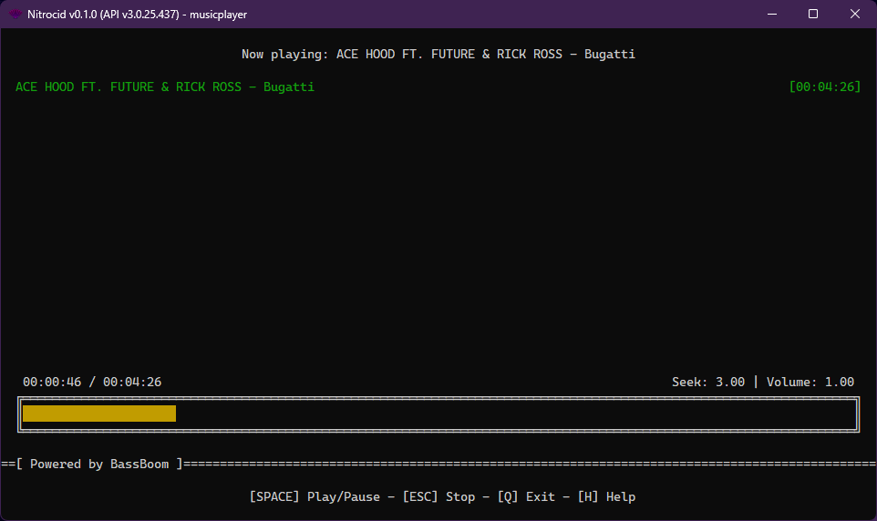

# Music Player

<figure><figcaption></figcaption></figure>


Nitrocid KS provides this feature as an addon.


Powered by BassBoom, Nitrocid KS provides an addon which hosts audio-related programs, such as the interactive music player and the simple sound player. This page talks about both, which allow you to play sound files.

## Music Player

The BassBoom addon features a completely interactive music player (`musicplayer`) that allows you to play music files with support for playlists. The controls for the music player are the same as for the player which is found in the BassBoom.Cli program. For more information, head to the below page:


[BassBoom CLI](https://app.gitbook.com/s/izAJoIbtQw1BdIlE4DBz/fundamentals/bassboom-features/bassboom-cli)


## Sound Player

In the other hand, this addon also features a simple sound player with no playlist support and only plays one sound file. You can either wait for the music to end, or press `q` to stop playing. You can use this feature using the `playsound` command.


Historically, 0.0.8 used to host a simple sound player and a TTS synthesizer using [VLC](https://www.nuget.org/packages/LibVLCSharp) as the backend. However, we've removed it as it showed signs of inconsistency.

Additionally, this feature was shipped as an addon, meaning that the [native VLC libraries](https://www.nuget.org/packages/VideoLAN.LibVLC.Windows) and its .NET wrapper are unsuitable for use in such configuration.

Furthermore, the 0.0.8.6 version and the 0.0.11.x versions have removed the VLC player support.


## Lyric Player and Manager

The BassBoom addon also provides you with a lyric player that you can invoke via the `playlyric` command. This only plays the lyric without its associated music. The `lyriclines` command only gives you the lyric lines and their parsed time spans.

## Online Radio Stations

You can use the `musicplayer -r` command to listen to your favorite online radio station, as long as it's an MP3-based radio station. You can easily verify this by taking a look at the MIME data that you can get using BassBoom's `RadioTools`' functions.


This feature requires an active Internet connection to work.


## Beep Synths

Create a handy JSON file from the below template:

```json
{
    "name": "Song",
    "chapters": [
        {
            "name": "Chapter 1",
            "synths": [
                "freq ms",
                "freq ms",
                [...]
            ]
        },
        {
            "name": "Chapter 2",
            "synths": [
                "freq ms",
                "freq ms",
                [...]
            ]
        },
        [...]
    ]
}
```

In the main `name` key found in the root object of the beep synth JSON representation, provide a song name. In the `chapters` key, provide an array of chapter objects that contain the two properties:

* `name`: Name of the chapter.
* `synths`: Synth representations in hertz and milliseconds, separated by a space. Pauses can be implemented by specifying the frequency of 0.

An example of a simple beep synth file looks like this:

```json
{
    "name": "Song",
    "chapters": [
        {
            "name": "Chapter 1",
            "synths": [
                "723 640",
                "323 750",
                "424 87"
            ]
        },
        {
            "name": "Chapter 2",
            "synths": [
                "400 800",
                "600 800",
                "800 800"
            ]
        },
    ]
}
```

Afterwards, save the file and play it using the `beepsynth` command, pointing it to your song JSON file.
