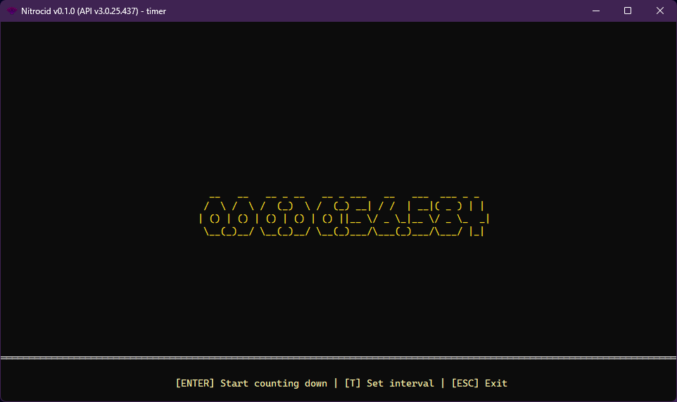
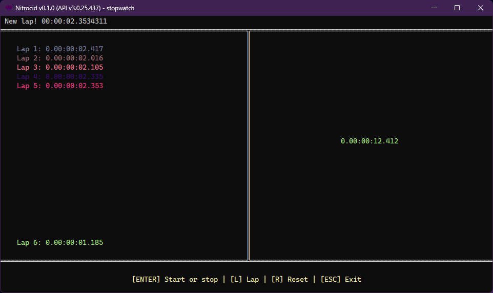

# Stopwatch and Timer


Nitrocid KS provides this feature as an addon.


The stopwatch is a timepiece that measures the elapsed time between the activation time and the current time. Generally, they're used to measure how much time did doing a specific thing take. The most famous example of a stopwatch is the stop clock, which is used in sports to measure the time between the start of the game and the current time.

Additionally, some stopwatches provide the laps system, which is useful for sports game that contains the laps, like racing or running.

The timer, however, counts down from the set time, usually minutes, to zero to set the target time. Once the time is up, the timer rings. It's used to limit the time in any action that should be done by humans.

The simulated kernel attempts to simulate the two features, which can be invoked by the two commands that will be listed below.

### Timer

<figure><figcaption></figcaption></figure>

The simulated kernel powers the timer feature that, by default, sets the remaining time to just one minute. The controls are:

* `ENTER`: Start counting down from the set time or reset counting down
* `T`: Specifies the remaining time in milliseconds
* `ESC`: Exits the application

You can start the application up with the `timer` command.

### Stopwatch

<figure><figcaption></figcaption></figure>

The simulated kernel also simulates the stopwatch functionality with the ability to set the laps. You can also reset the stopwatch. The controls are:

* `ENTER`: Starts counting up the time or stops the entire stopwatch
* `L`: Sets the lap on the current elapsed time
* `SHIFT + L`: Shows a complete list of laps in an infobox
* `R`: Resets the stopwatch and its laps
* `ESC`: Exits the application

You can start the application up with the `stopwatch` command.
